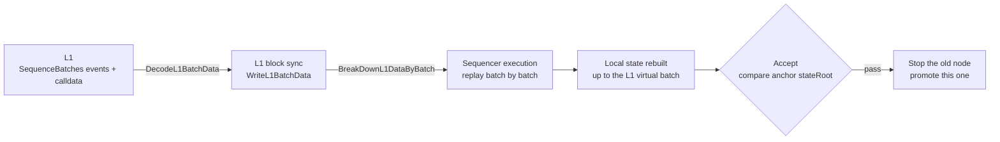

# Rebuild a sequencer node from L1

Use the tools in this directory when the sequencer's local data is lost, corrupt, or rolled back (for example a recreated container attached to an old volume) and the **local batch is behind history already sequenced on L1**. They rebuild node state from L1 calldata, then switch traffic back.

> Rollup mode only (full batch data is in L1 calldata).
> Validium stores only a data hash on L1, so this flow does not apply; use the DAC or a backup.

---

## 1. When to use this

Check on the live node:

```bash
# Latest local batch
curl -X POST http://localhost:8545 -H 'Content-Type: application/json' \
  -d '{"jsonrpc":"2.0","id":1,"method":"zkevm_batchNumber","params":[]}'

# Batches virtualized / verified on L1
curl -X POST http://localhost:8545 -H 'Content-Type: application/json' \
  -d '{"jsonrpc":"2.0","id":1,"method":"zkevm_virtualBatchNumber","params":[]}'
curl -X POST http://localhost:8545 -H 'Content-Type: application/json' \
  -d '{"jsonrpc":"2.0","id":1,"method":"zkevm_verifiedBatchNumber","params":[]}'
```

On a healthy chain the three values match (or the local one is slightly ahead). This means local state is behind L1 history:

```
zkevm_batchNumber (local) < zkevm_virtualBatchNumber (L1)
```

Typical symptoms:

- aggregator logs `no blocks found for batch N` / `BatchL2Data does not match RPC`;
- `zkevm_getBatchByNumber(N)` returns `null` while N ≤ the L1 virtual batch;
- sequence-sender idles (L1 is waiting for a batch the local node will never have).

## 2. How it works

cdk-erigon has a built-in **L1 recovery mode**. With `zkevm.l1-sync-start-block > 0`, the sequencer ignores the datastream and replays every batch from L1 to rebuild state:



Important behavior:

- `Starting sequencer in L1 recovery mode` in the log means the mode is active;
- `zkevm.l1-sync-stop-batch: N` stops recovery at batch N, as a **verification gate**;
- sequencer L1 recovery replays block by block. It does not use `l2-short-circuit-to-verified-batch`. Empty blocks also wait on `sequencer-timeout-on-empty-tx-pool` (250ms by default). This flow sets that to `0s` during recovery; otherwise a few thousand batches of empty blocks take tens of hours. Cutover restores `250ms`;
- replay is deterministic: if the binary's execution rules are compatible with the history, the rebuilt stateRoot matches the L1-verified value. That is what acceptance checks.

## 3. Prerequisites

| Requirement | How to confirm |
|---|---|
| Chain is in rollup mode | Sequence-tx calldata is full batch data (hundreds of bytes or more), not a 32-byte hash |
| L1 node has full history | L1 RPC can return SequenceBatches events since `l1-first-block` |
| Image execution rules match history | If a precompile or other consensus change was added, confirm no historical tx touched it (for example nothing ever called 0x1000) |
| Disk space | About the same as the original datadir |
| Keep the old site | Do not delete or modify the old data volume; it is the rollback path |

## 4. Steps

### Step 0: collect values

Edit `.env` (`cp env.example .env`) for this incident:

```bash
# Latest virtual batch on L1 (recovery target) = zkevm_virtualBatchNumber above
EXPECTED_BATCH=4390
L1_SYNC_STOP_BATCH=4390

# Anchor: latest L1-verified batch and its stateRoot.
# From the last VerifyBatches event on the L1 rollup contract:
#   cast logs --rpc-url <L1_RPC> --address <rollup-contract> --from-block <l1-first-block> \
#     "VerifyBatches(uint64,bytes32)"  | tail -1
# Or from aggregator logs / an L1 explorer. The data field is the stateRoot.
ANCHOR_BATCH=4387
ANCHOR_STATE_ROOT=0x898007fd4a43e2144f265225fbd256adb808e5cc0631b4a78726310d2ca09cf2

# A batch that was missing on the old node (the one named in the error)
SPOT_CHECK_BATCH=4388
```

### Step 1: start the recovery node

```bash
cd qday/recover
docker compose -f docker-compose.recover.yml --env-file .env up -d
docker logs -f qday2-sequencer-recover
```

The recovery node has its **own container name, datadir `./datadir-recover`, and ports (8645/6901)**. It is isolated from the live node and can run at the same time.

Watch the logs:

- `Starting sequencer in L1 recovery mode` — recovery mode is active;
- the batch number keeps advancing;
- `L1 recovery has completed!` — replay reached `L1_SYNC_STOP_BATCH`.

`Stopping L1 sync stage based on configured stop batch` only means the L1 batch data up to the stop batch is already downloaded. Execution may still be replaying. That line is printed once per stage loop and is followed by a 1s sleep.

Most of the time goes to the L1 scan (block count / `l1-block-range`) and to blocks that contain transactions. With `SEQUENCER_TIMEOUT_ON_EMPTY_TX_POOL=0s`, empty blocks no longer wait 250ms each. `Finish block ... taken=` should be far below 250ms. A steady ~250ms means the container is still on the old command line and must be recreated as below.

A container that is already running does not pick this up by itself. L1 recovery commits the database at the end of each batch, but the datastream file (`datadir-recover/data-stream`) is written as each block is produced. Recreating mid-batch leaves the datastream batch number ahead of `HighestSeenBatchNumber` in the database, and startup then loops on:

```text
The node need re-sequencing but this option is disabled.
```

Do not enable `zkevm.sequencer-resequence` for this (it cannot run together with L1 recovery). Stop the container, delete that datastream file, then recreate. An empty file is rewritten from committed state on startup. The uncommitted batch is replayed from L1; finished batches are kept:

```bash
docker compose -f docker-compose.recover.yml --env-file .env stop
rm -f datadir-recover/data-stream
docker compose -f docker-compose.recover.yml --env-file .env up -d --force-recreate
```

### Step 2: verify

```bash
./verify-recovery.sh
```

Checks, in order: batch height, **anchor stateRoot** (the proof), spot-check batch data, witness generation, and L1 virtual-batch agreement. Cut over only when every check is PASS. Any FAIL blocks cutover and points at what to inspect.

### Step 3: cut over

```bash
./cutover.sh
```

The script re-checks, stops the old node (`qday2-sequencer`, data volume kept), moves the recovery node to ports 8545/6900 and clears the stop-batch gate (it becomes a normal sequencer and opens new batches from the L1 tip), restarts cdk components, then checks again.

### Step 4: confirm recovery

```bash
docker logs -f cdk-aggregator
```

Expect:

- no more `BatchL2Data ... does not match RPC`;
- validator signatures and settlement tx logs;
- the L1 verified batch advances from the anchor to `EXPECTED_BATCH`;
- a test transaction: new batch closes, is sequenced on L1, then settles.

### Step 5: wrap up

After the chain has been stable (a few days is a good window):

1. Set `L1_SYNC_START_BLOCK` to `0` in `.env` and restart the node (leave L1 recovery mode and use the normal startup path);
2. Remove the old data volume only after that looks fine;
3. Do not `up` the previous stack (`qday/dynamic-configs/docker-compose.yml`) again. Keep this recovery node as the long-term sequencer (renaming the container or directory is fine).

## 5. Troubleshooting

| Symptom | Cause and what to do |
|---|---|
| Startup panic `could not open chainspec` | Dynamic-chain config loads from the `--config` directory. Check that the three single-file `dynamic-qday2-testnet-*.json` mounts in compose are intact |
| Log never shows `L1 recovery mode` | `L1_SYNC_START_BLOCK` is 0 or was not passed. Check `.env` and the compose command line |
| SequenceBatches events never show up | `L1_SYNC_START_BLOCK` / `l1-first-block` is after the contract deployment block, or the L1 RPC history is pruned |
| Stuck on one batch | Decoding or executing that batch's L1 data failed. Read the error. Often an incompatible execution rule (see the prerequisites table) |
| `Finish block` `taken` stays around 250ms | Empty-pool wait is still the 250ms default. Set `SEQUENCER_TIMEOUT_ON_EMPTY_TX_POOL=0s` in `.env`, then delete `datadir-recover/data-stream` and recreate as in step 1 |
| `The node need re-sequencing but this option is disabled` | A recreate left the datastream ahead of the last committed batch. Stop the container, `rm -f datadir-recover/data-stream`, then `up`. Do not enable `sequencer-resequence` |
| Check [2] stateRoot does not match | Replay forked from L1-verified state. **Do not cut over.** Check the image version and that genesis allocs match history |
| Check [3] or [4] fails | Recovery did not cover that batch. Confirm `L1_SYNC_STOP_BATCH` ≥ that batch and that L1 actually sequenced it |

## 6. Rollback

If any step goes wrong:

```bash
docker stop qday2-sequencer-recover
docker start qday2-sequencer
docker restart cdk-aggregator cdk-sequence-sender cdk-validator
```

That returns to the pre-cutover state (the chain is still stuck, but no worse). Investigate and retry.

## 7. Files

| File | Role |
|---|---|
| `README.md` | This guide |
| `dynamic-recover.yaml` | Recovery node config (based on `dynamic-validium.yaml`) |
| `docker-compose.recover.yml` | Recovery node compose (own container, datadir, and ports) |
| `env.example` | Sample environment (includes how to fill the acceptance anchor) |
| `verify-recovery.sh` | Acceptance script (5 checks; all must pass before cutover) |
| `cutover.sh` | Cutover script (re-check, stop old node, promote, restart cdk, re-check) |
