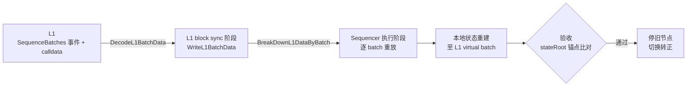

# 从 L1 重建 Sequencer 节点

当 sequencer 的本地数据丢失、损坏或回滚(例如容器重建时挂了旧数据卷),
导致**本地 batch 落后于 L1 已 sequencing 的历史**时,可以用本目录的工具
从 L1 calldata 完整重建节点状态,再把流量切回来。

> 仅适用于 **rollup 模式**(batch 数据完整记录在 L1 calldata)。
> validium 模式下 L1 只有数据哈希,必须依赖 DAC 或备份,本流程不适用。

---

## 1. 什么时候需要本流程

判断依据(在现役节点上执行):

```bash
# 本地最新 batch
curl -X POST http://localhost:8545 -H 'Content-Type: application/json' \
  -d '{"jsonrpc":"2.0","id":1,"method":"zkevm_batchNumber","params":[]}'

# L1 已虚拟化 / 已验证的 batch
curl -X POST http://localhost:8545 -H 'Content-Type: application/json' \
  -d '{"jsonrpc":"2.0","id":1,"method":"zkevm_virtualBatchNumber","params":[]}'
curl -X POST http://localhost:8545 -H 'Content-Type: application/json' \
  -d '{"jsonrpc":"2.0","id":1,"method":"zkevm_verifiedBatchNumber","params":[]}'
```

正常链三者相等(或本地略领先)。如果出现:

```
zkevm_batchNumber(本地) < zkevm_virtualBatchNumber(L1)
```

说明本地状态落后于 L1 历史,典型症状:

- aggregator 报 `no blocks found for batch N` / `BatchL2Data does not match RPC`;
- `zkevm_getBatchByNumber(N)` 返回 `null`,而 N ≤ L1 virtual batch;
- sequence-sender 空转(L1 在等一个本地永远不存在的 batch)。

## 2. 原理

cdk-erigon 内置 **L1 recovery 模式**:设置 `zkevm.l1-sync-start-block > 0` 后,
sequencer 不使用 datastream,改为从 L1 重放全部 batch 来重建状态:



关键行为:

- 日志出现 `Starting sequencer in L1 recovery mode` 即表示模式生效;
- `zkevm.l1-sync-stop-batch: N` 让恢复到 batch N 即停,作为**验证关卡**;
- sequencer 的 L1 recovery 逐块重放,不走 `l2-short-circuit-to-verified-batch`。
  空块默认还会等 `sequencer-timeout-on-empty-tx-pool`(250ms)。本流程在恢复期间
  把它设为 `0s`,否则几千个 batch 的空块要跑几十小时;切换转正时改回 `250ms`;
- 重放是确定性的:只要二进制执行规则与产生历史时兼容,重建后的
  stateRoot 必然与 L1 已验证值一致——这就是验收的数学依据。

## 3. 前提条件

| 条件 | 确认方法 |
|---|---|
| 链为 rollup 模式 | sequence 交易 calldata 为完整 batch 数据(几百字节以上),不是 32 字节哈希 |
| L1 节点历史完整 | L1 RPC 能查到 `l1-first-block` 以来的 SequenceBatches 事件 |
| 镜像执行规则与历史兼容 | 若期间加过预编译等共识改动,确认历史交易未触及(如 0x1000 从无交易调用) |
| 磁盘空间 | 与原数据目录相当 |
| 旧现场保留 | 旧数据卷全程不删不改,作为回滚保障 |

## 4. 操作步骤

### 第 0 步:取值

编辑 `.env`(`cp env.example .env`),按当前事故实际情况填:

```bash
# L1 最新 virtual batch(恢复目标)= 上面 zkevm_virtualBatchNumber 的结果
EXPECTED_BATCH=4390
L1_SYNC_STOP_BATCH=4390

# 验收锚点:L1 已验证的最新 batch 及其 stateRoot。
# 从 L1 上 rollup 合约的 VerifyBatches 事件取(最后一次 verify):
#   cast logs --rpc-url <L1_RPC> --address <rollup合约> --from-block <l1-first-block> \
#     "VerifyBatches(uint64,bytes32)"  | tail -1
# 或对照 aggregator 日志 / L1 浏览器。data 字段即 stateRoot。
ANCHOR_BATCH=4387
ANCHOR_STATE_ROOT=0x898007fd4a43e2144f265225fbd256adb808e5cc0631b4a78726310d2ca09cf2

# 抽查一个在旧节点上缺失的 batch(报错信息里出现的那个)
SPOT_CHECK_BATCH=4388
```

### 第 1 步:启动恢复节点

```bash
cd qday/recover
docker compose -f docker-compose.recover.yml --env-file .env up -d
docker logs -f qday2-sequencer-recover
```

恢复节点使用**独立容器名、独立数据目录 `./datadir-recover`、独立端口
(8645/6901)**,与现役节点完全隔离,可以同时运行。

观察日志:

- `Starting sequencer in L1 recovery mode` — recovery 生效;
- batch 号持续推进;
- `Stopping L1 sync based on stop batch config` — 到达 `L1_SYNC_STOP_BATCH`,恢复完成。

参考耗时:主要花在 L1 扫描(块数 / `l1-block-range`)和有交易的块上。
空块在 `SEQUENCER_TIMEOUT_ON_EMPTY_TX_POOL=0s` 下不再每块等 250ms。
日志里 `Finish block ... taken=` 应远小于 250ms;若稳定在 250ms 左右,
说明容器还是旧命令行,需要按下面的方式重建。

已经在跑的恢复容器不会自动吃到这项。重建(当前未提交的 batch 会重放,已完成的 batch 保留):

```bash
docker compose -f docker-compose.recover.yml --env-file .env up -d --force-recreate
```

### 第 2 步:验收

```bash
./verify-recovery.sh
```

逐项检查:batch 高度、**锚点 stateRoot 一致性**(数学证明)、抽查 batch 数据、
witness 生成、L1 virtual 一致性。全部 PASS 才能切换;任一 FAIL 都会禁止切换
并提示排查方向。

### 第 3 步:切换

```bash
./cutover.sh
```

脚本自动完成:切换前复检 → 停旧节点(`qday2-sequencer`,数据卷保留)→
恢复节点切到标准端口 8545/6900 并摘掉 stop-batch 关卡(转为正常 sequencer,
从 L1 顶端继续开新 batch)→ 重启 cdk 组件 → 切换后复检。

### 第 4 步:恢复确认

```bash
docker logs -f cdk-aggregator
```

预期:

- 不再报 `BatchL2Data ... does not match RPC`;
- 出现 validator 签名、settlement tx 日志;
- L1 verified batch 从锚点推进到 `EXPECTED_BATCH`;
- 发一笔测试交易:新 batch 关闭 → sequencing 上链 → 结算,全链路恢复。

### 第 5 步:收尾

链稳定运行后(建议观察数天):

1. 把 `.env` 中 `L1_SYNC_START_BLOCK` 改为 `0` 并重启节点
   (退出 L1 recovery 模式,恢复正常启动路径);
2. 确认无问题后清理旧数据卷;
3. 现役栈(`qday/dynamic-configs/docker-compose.yml`)不要再 `up`,
   或以本恢复节点为准做长期化(改回原容器名/目录均可)。

## 5. 故障排查

| 现象 | 原因与处理 |
|---|---|
| 启动 panic `could not open chainspec` | 动态链配置从 `--config` 同目录加载;检查 compose 里三个 `dynamic-qday2-testnet-*.json` 单文件挂载是否失效 |
| 日志没有 `L1 recovery mode` | `L1_SYNC_START_BLOCK` 为 0 或未传到;检查 `.env` 与 compose 命令行 |
| 一直扫不到 SequenceBatches 事件 | `L1_SYNC_START_BLOCK` / `l1-first-block` 大于合约部署块;或 L1 RPC 历史缺失(pruned) |
| 卡在某个 batch 不动 | 该 batch 的 L1 数据解码/执行失败,看日志报错;常见于执行规则不兼容(见前提条件表) |
| `Finish block` 的 `taken` 稳定在约 250ms | 空池等待仍是默认 250ms。确认 `.env` 里 `SEQUENCER_TIMEOUT_ON_EMPTY_TX_POOL=0s`,然后 `--force-recreate` |
| 验收第 [2] 项 stateRoot 不一致 | 重放结果与 L1 已验证状态分叉,**禁止切换**;检查镜像版本、genesis allocs 是否与历史一致 |
| 验收第 [3]/[4] 项失败 | 恢复未覆盖该 batch;确认 `L1_SYNC_STOP_BATCH` ≥ 该 batch,且 L1 上确有该 batch 的 sequence |

## 6. 回滚

任何一步出问题:

```bash
docker stop qday2-sequencer-recover
docker start qday2-sequencer
docker restart cdk-aggregator cdk-sequence-sender cdk-validator
```

即回到切换前状态(链仍是卡住的,但不会更坏),排查后可重试。

## 7. 文件清单

| 文件 | 作用 |
|---|---|
| `README.md` | 本教程 |
| `dynamic-recover.yaml` | 恢复节点配置(基于 `dynamic-validium.yaml`) |
| `docker-compose.recover.yml` | 恢复节点编排(独立容器/数据目录/端口) |
| `env.example` | 环境变量样例(含验收锚点取值说明) |
| `verify-recovery.sh` | 验收脚本(5 项检查,全过才允许切换) |
| `cutover.sh` | 切换脚本(复检 → 停旧 → 转正 → 重启 cdk → 复检) |
